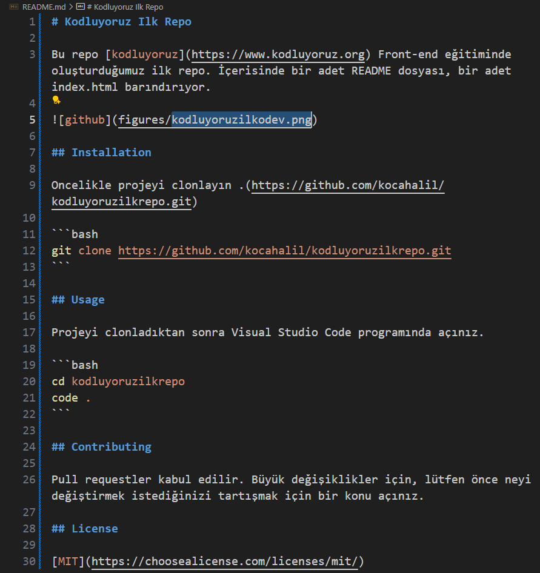

# Kodluyoruz Ilk Repo

Bu repo [kodluyoruz](https://www.kodluyoruz.org) Front-end eğitiminde oluşturduğumuz ilk repo. İçerisinde bir adet README dosyası, bir adet index.html barındırıyor.



## Installation

Oncelikle projeyi clonlayın .(https://github.com/kocahalil/kodluyoruzilkrepo.git)

```bash
git clone https://github.com/kocahalil/kodluyoruzilkrepo.git
```

## Usage

Projeyi clonladıktan sonra Visual Studio Code programında açınız.

```bash
cd kodluyoruzilkrepo
code .
```

## Contributing

Pull requestler kabul edilir. Büyük değişiklikler için, lütfen önce neyi değiştirmek istediğinizi tartışmak için bir konu açınız.

## License

[MIT](https://choosealicense.com/licenses/mit/)
